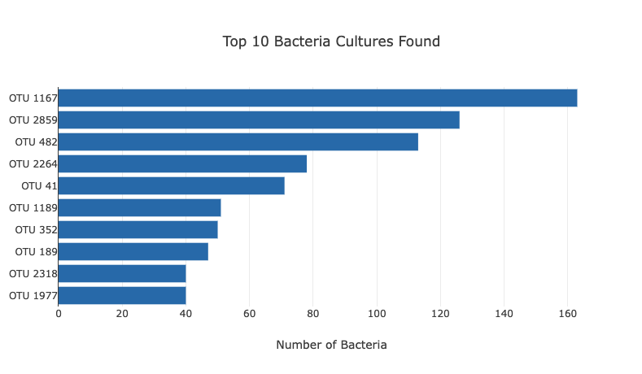
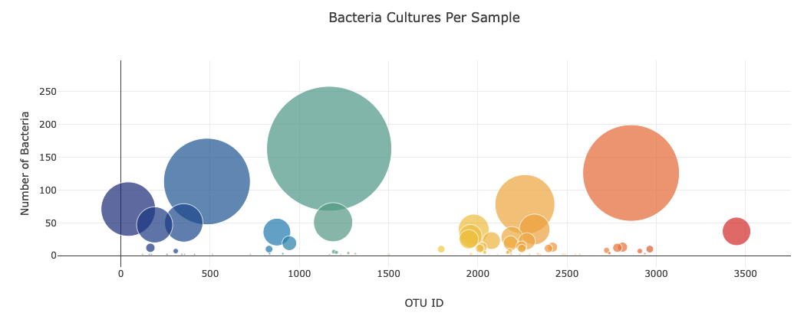
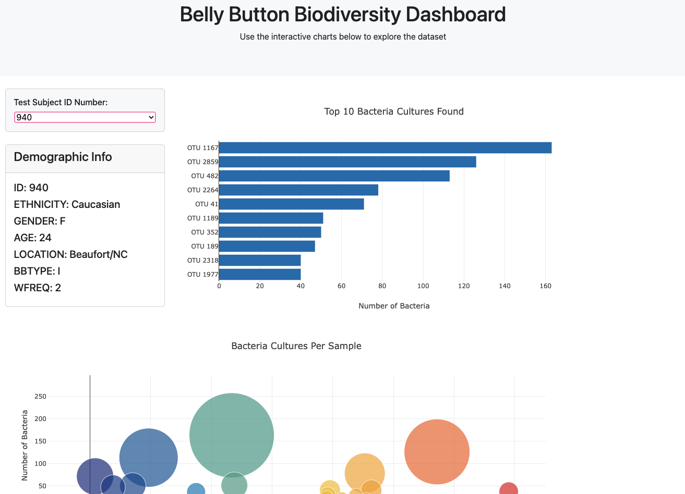

# Belly Button Biodiversity Challenge

Datasource: https://robdunnlab.com/projects/belly-button-biodiversity/

## Bar Chart

## Bubble Chart
colorscale: 'Portland'

### Belly Button Biodiversity Dashboard

### Resources
Changing the colorscale of bubble chart: https://plotly.com/javascript/colorscales/
